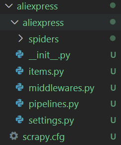
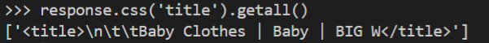
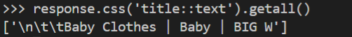
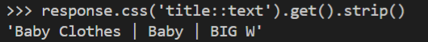
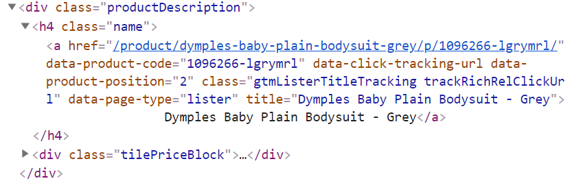

# Build a web crawler with [Scrapy](https://scrapy.org/)
---
*Notice: This file was created for self-learning purpose only.*

### 1. Creating a Scrapy project 
Write the following code in command line:

``scrapy startproject projectName``

If success, a new folder will be created. The detail of the folder is as below: 



**The purpose of each file is listed below:**
<table>
<thead>
<tr>
<th>file/folder</th>
<th>Purpose</th>
</tr>
</thead>
<tbody>
<tr>
<td>scrapy.cfg</td>
<td>deploy configuration file</td>
</tr>
<tr>
<td>aliexpress/</td>
<td>Project's Python module, you'll import your code from here</td>
</tr>
<tr>
<td><code>__init.py__</code></td>
<td>Initialization file</td>
</tr>
<tr>
<td>items.py</td>
<td>project items file</td>
</tr>
<tr>
<td>pipelines.py</td>
<td>project pipelines file</td>
</tr>
<tr>
<td>settings.py</td>
<td>project settings file</td>
</tr>
<tr>
<td>spiders/</td>
<td>a directory where you'll later put your spiders</td>
</tr>
<tr>
<td><code>__init.py__</code></td>
<td>Initialization file</td>
</tr>
</tbody>
</table>


### 2. Generate first spider 
Use ``scrapy genspider spiderName websiteURl.com`` to generate a spider. Then it will create a file named ``spiderName.py`` in the spiders directory. In this file:
* **name**: it is the name of the spider. Spider can be used by ``scrapy crawl spiderName``
* **allowed_domains (optional)**: An optional python list, contains domains that are allowed to get crawled. 
* **start_urls**: A list of URLs where the spider will begin to crawl from. 
* **parse(self, response)**: This function will be called whenever a URL is crawled successfully. **Write the extraction coe inside it!**

### 3. Extract data 
 **Note**: You can extract data with css selectors using ``response.css()`` or XPath(XML) by using ``response.xpath()`` in the code edited in ``pass`` function. 

 <br>* **Using ``scrapy shell websiteURL.com`` can enter the scrapy shell to test selecting elements using CSS with the response objec. some website may return HTTP 403 error. Solved by add an agent: ``scrapy shell --set=USER_AGENT='Mozilla/5.0 URL.com``**

 * Extract data with **response.css()**
    * **response.css('title').getall()**
    <br> We will get the full title element including its tags if we don't specify ``::text``.
    
    * **response.css('title::text').getall()**
    <br> It will extract all the text within the title element. By using ``get()`` instead of ``getall()``, only first result will return. 
    

    * **Trim the text** <br>Using ``.strip()`` function can remove the space at the begining and the end of the text.
    

    * **Examples**
      
    Using ``response.css('h4.name a::text').get()`` can extract the item name from above code. 
    <br> Using ``response.css('h4.name a::attr(href)').get()`` can get the href link in the tag.
  
  * **Extract data wiht XPath**
    * E.g.: ``response.xpath('//title')``
    * More detail refers to the [scrapy documentation](https://docs.scrapy.org/en/latest/intro/tutorial.html)

### 4. Storing the data
  Using ``scrapy crawl spiderName -O fileName.json`` command in terminal can output the data into a json file. Besides json, it also support other format such as: csv, xml, marshal.

### 5. Following links 
If you want to extract data from all pages, you need to extract the link to the page we want to follow first. Using ``response.css('a::attr(href)').get()`` to extract the href link of next page. Then add following code into the spider file:
```
# generate a request to crawling next page 
nextPage = response.css('li.next a::attr(href)').get()
# check if the next page is not none
if nextPage is not None: 
    nextPage = response.urljoin(nextPage)
    yield scrapy.Request(nextPage, callback = self.parse)
```
The spider will follow the link until hit the end. Also, you can define the rules by your own. 

