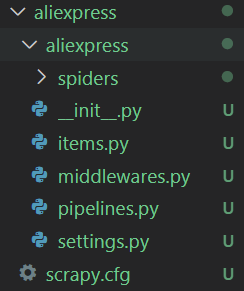

# Build a web crawler with [Scrapy](https://scrapy.org/)
---

### 1. Creating a Scrapy project 
Write the following code in command line:

``scrapy startproject projectName``

If success, a new folder will be created. The detail of the folder is as below: 

**The purpose of each file is listed below:**
<table>
<thead>
<tr>
<th>file/folder</th>
<th>Purpose</th>
</tr>
</thead>
<tbody>
<tr>
<td>scrapy.cfg</td>
<td>deploy configuration file</td>
</tr>
<tr>
<td>aliexpress/</td>
<td>Project's Python module, you'll import your code from here</td>
</tr>
<tr>
<td><code>__init.py__</code></td>
<td>Initialization file</td>
</tr>
<tr>
<td>items.py</td>
<td>project items file</td>
</tr>
<tr>
<td>pipelines.py</td>
<td>project pipelines file</td>
</tr>
<tr>
<td>settings.py</td>
<td>project settings file</td>
</tr>
<tr>
<td>spiders/</td>
<td>a directory where you'll later put your spiders</td>
</tr>
<tr>
<td><code>__init.py__</code></td>
<td>Initialization file</td>
</tr>
</tbody>
</table>

### 2. Generate first spider 
Use ``scrapy genspider spiderName websiteURl.com`` to generate a spider. Then it will create a file named ``spiderName.py`` in the spiders directory. In this file:
* **name**: it is the name of the spider. Spider can be used by ``scrapy crawl spiderName``
* **allowed_domains**: An optional python list, contains domains that are allowed to get crawled. 
* **start_urls**: A list of URLs where the spider will begin to crawl from. 
* **parse(self, response)**: This function will be called whenever a URL is crawled successfully. **Write the extraction coe inside it!**
  
    **Note**: You can extract data with css selectors using ``response.css()`` or XPath(XML) by using ``response.xpath()`` in the code edited in ``pass`` function. 
